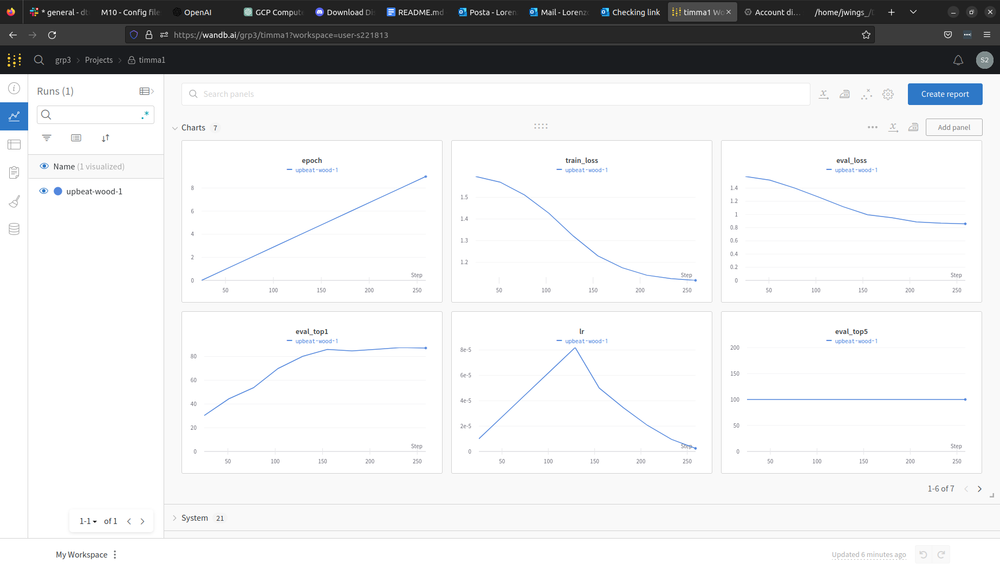
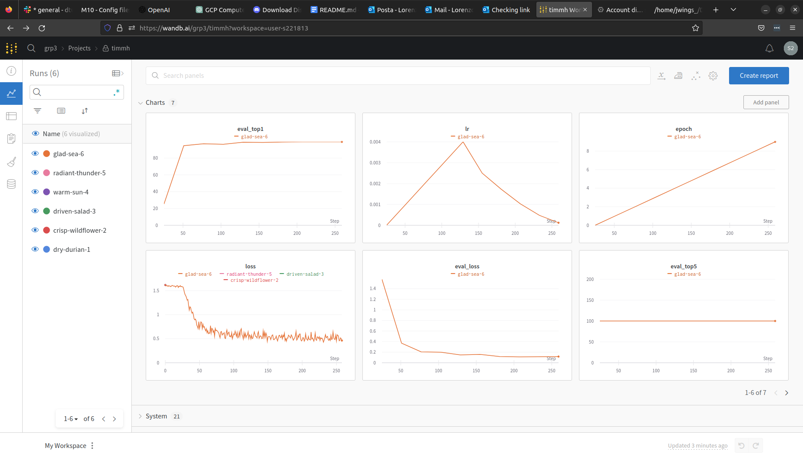
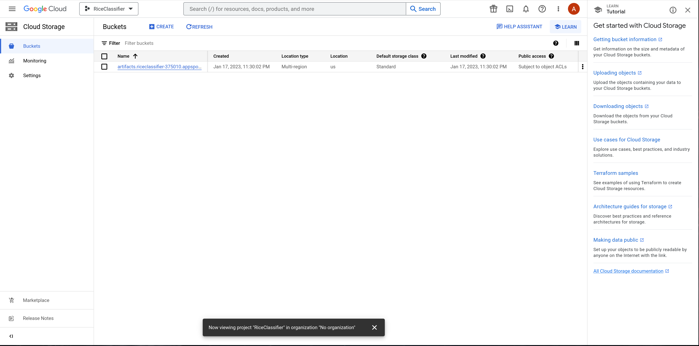
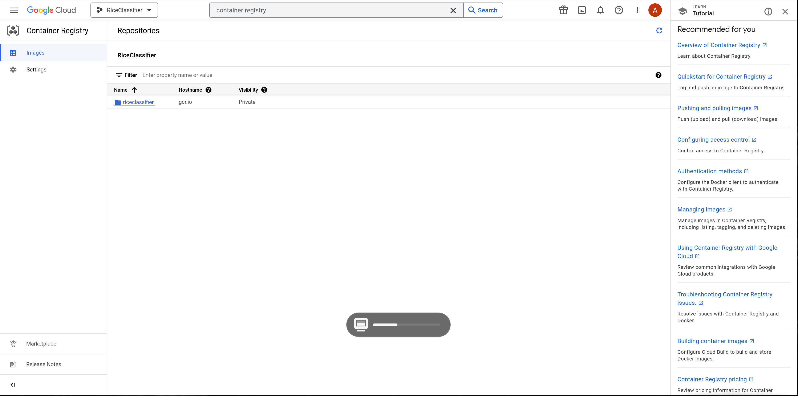
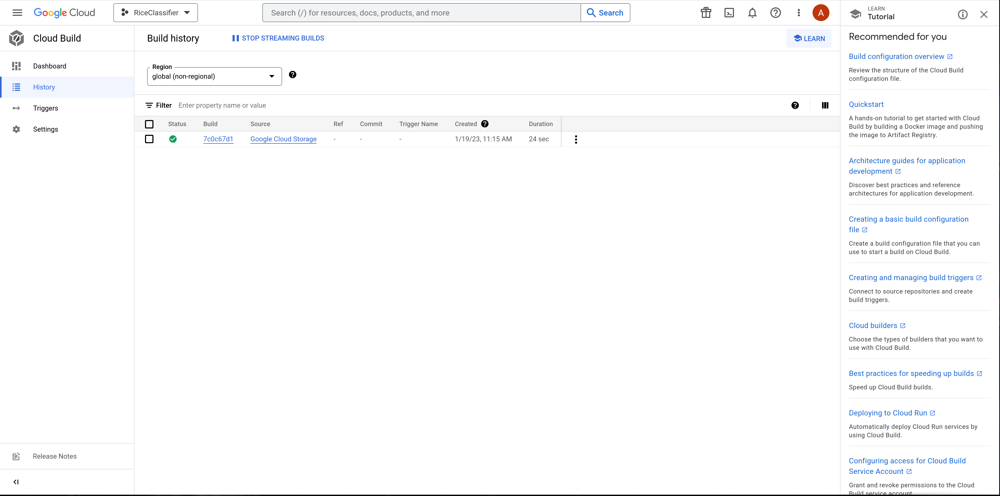
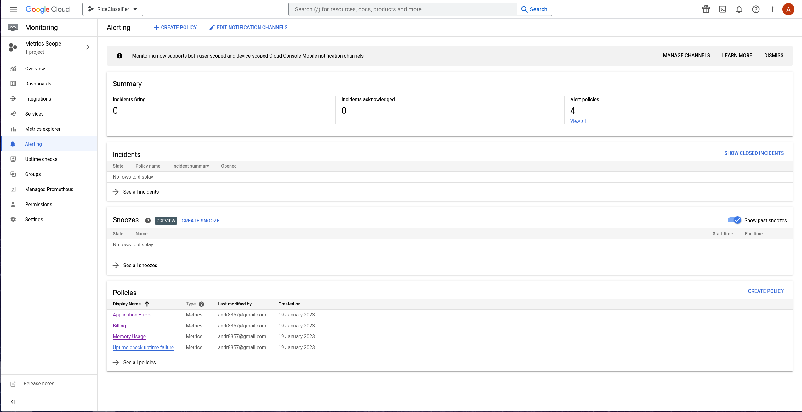
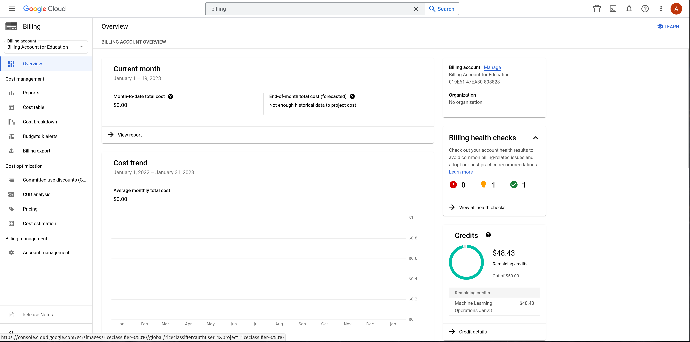
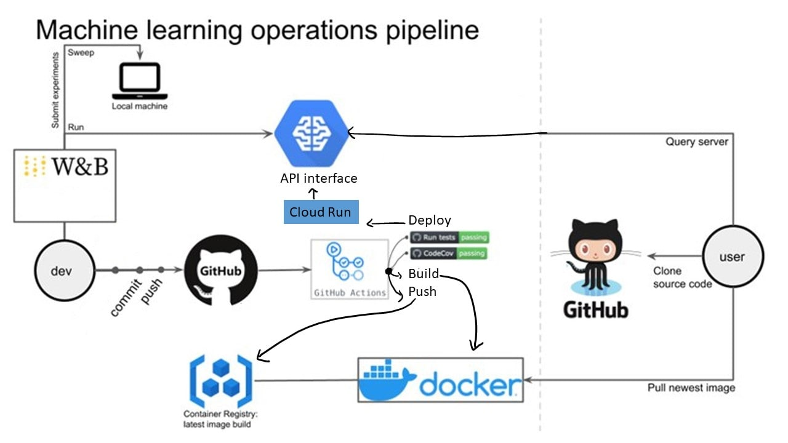

# Exam report for 02476 Machine Learning Operations

## Group information

### Question 1
> **Enter the group number you signed up on <learn.inside.dtu.dk>**

3

### Question 2
> **Enter the study number for each member in the group**

s164397, s221813, s174261, s174250

### Question 3
> **What framework did you choose to work with and did it help you complete the project?**

We, as a team, successfully developed an image classifier that can accurately classify different varieties of rice. The classifier is able to distinguish between Arborio, Basmati, Ipsala, Jasmine, and Karacadag rice. To create the classifier, we utilized a deep learning model and utilized the PyTorch Images framework (Timm) to import a pre-trained ResNet50 model and a training script. We imported a large dataset of rice images from Kaggle.com to train our model. We found that by utilizing a deep learning model and a large dataset, we were able to achieve a high level of accuracy in classifying the different varieties of rice. Additionally, our pipeline involved using W&B, GCP, and GitHub for tracking our progress, storing our data, and deploying our model. Overall, this project was a great success and using TIMM made it easier to deploy the model and helped us put more focus on our pipeline.

## Coding environment

> In the following section we are interested in learning more about your local development environment.

### Question 4

> **Explain how you managed dependencies in your project? Explain the process a new team member would have to go**
> **through to get an exact copy of your environment.**

We used (mini)conda, pipreqs, docker, and git to manage our dependencies. We created a conda environment to make sure that the dependencies of our project do not cross-contaminate with others. Requirements of both pip and conda were handled by package pipreqs. To get a complete copy of our development environment, one would have to build our docker file: 

docker build -f Docker.dockerfile . -t trainer:latest. 

This file contains requirements.txt and environment.yml (generated wrespectively with commands pipreqs and conda env export > environment.yml). Finally, version control was managed with Git. A new team member would be invited to join the github repository, clone it, and run the docker file. 

### Question 5

> **We expect that you initialized your project using the cookiecutter template. Explain the overall structure of your**
> **code. Did you fill out every folder or only a subset?**

We used cookiecutter to create a template for our project. We mostly used it as a starting point for the creation of the project in order to have a more organized project.

The project folder contains any configuration files necessary for the project, such as settings for a specific framework or environment. The data folder is used to store any data related to the project, such as training and validation data and make_dataset.py file.

The models folder is used to store our imported model. The reports folder is used to store any reports generated by the project, such as performance metrics or analysis results. The src folder contains the source code for the project, including the training script under models/train_model.py

The test folder is used to store any test cases and test scripts used to test the project. The test folder includes subfolders for unit tests, integration tests, and acceptance tests.

From the original template we removed the LICENSE file, the notebooks, and references folders as not of interest to our project. We added the config folder. 

### Question 6

> **Did you implement any rules for code quality and format? Additionally, explain with your own words why these**
> **concepts matters in larger projects.**

Our code is formatted to meet Pep8 standards via black editor. Import statements are taken care of with isort. Rules for code and quality format are important as they ensure consistency, maintainability, and readability in large projects. This improves collaboration and reduces errors, ultimately saving time and resources. 

## Version control

> In the following section we are interested in how version control was used in your project during development to
> corporate and increase the quality of your code.

### Question 7

> **How many tests did you implement?**

7

### Question 8

> **What is the total code coverage (in percentage) of your code? If you code had an code coverage of 100% (or close**
> **to), would you still trust it to be error free? Explain you reasoning.**

No, having a code coverage of 100% does not guarantee that the code is error-free. Code coverage measures the percentage of code that is executed during testing, but it does not take into account the quality of the tests or the correctness of the code logic. Even if all lines of code are executed, there may still be bugs or errors present in the code. Additionally, code coverage does not account for edge cases or unexpected inputs that may cause the code to fail. Therefore, it is important to also conduct thorough testing and code review to ensure the overall quality and reliability of the code. We have 100% code coverage on the prediction model (predict_model.py) and the API (main.py). We also have the TIMM training script and modules, but since we did not create those, we do not have tests for them.

### Question 9

> **Did you workflow include using branches and pull requests? If yes, explain how. If not, explain how branches and**
> **pull request can help improve version control.**

We made use of both branches and PRs in our project. For each feature or change we created a new branch. Each branch worked on different tasks: on one we created a dedicated environment for the project to keep track of packages, filled out the requirements.txt file, checked code formatting, setup version control, wrote one configuration file for our experiments, created a data storage in GCP Bucket for our data and linked this with our data version control setup. On another one we used Weights & Biases to log training progress and other important metrics/artifacts in out code; another one was used to write unit tests related to the data part of our code, to model construction and or model training, calculate the coverage and finally another to create a FastAPI application that can do inference using our model, and create a trigger workflow for automatically building our docker images.

### Question 10

> **Did you use DVC for managing data in your project? If yes, then how did it improve your project to have version**
> **control of your data. If no, explain a case where it would be beneficial to have version control of your data.**

Yes, initially Google Drive, then GCP bucket, and finally Git Large File System. Although we set up data version control, our dataset was never modified. In general, DVC is beneficial in managing data in a project when multiple team members are working on the same data set. With data version control, team members can collaborate on the dataset and make changes without interfering with each other's work. It also allows for easy tracking of changes and rollbacks if necessary. Additionally, data version control makes it easy to reproduce results and maintain a clear history of changes to the data set, which is essential for transparency and reproducibility in research projects. Overall, data version control ensures efficient collaboration and accountability in data management.

### Question 11

> **Discuss you continues integration setup. What kind of CI are you running (unittesting, linting, etc.)? Do you test**
> **multiple operating systems, python version etc. Do you make use of caching? Feel free to insert a link to one of**
> **your github actions workflow.**

To control the testing and deploying we used git workflow. The test suite that we use consists of validation testing and unit testing. We use two git hub triggers, one for pull request on the main, which runs the validation test and unit test suite, and one for pushing/merging to main, which runs  the build and deployment suite after having passed all tests. The tests suite tests various versions of python, but only on linux(ubuntu) which the docker container is built on. 

The validation tests consist of checking if the newest module gives the correct inference on some custom data. We also verify the data used to train the model, by checking if the format of the training data is correct. The unit testing consists of testing the front end api, to ensure excellent user experience.

Overall, our use of git workflow and a comprehensive test suite allowed us to efficiently and effectively test and deploy our project, ensuring the highest quality for our users.

The workflows can be found here:

<https://github.com/Snirpurin/MLOPS_group3/tree/main/.github/workflows>

## Running code and tracking experiments

> In the following section we are interested in learning more about the experimental setup for running your code and
> especially the reproducibility of your experiments.

### Question 12

> **How did you configure experiments? Did you make use of config files? Explain with coding examples of how you would**
> **run a experiment.**

As a first apporoach, we used a simple argparser, that worked in the following way:

python train.py --lr 1e-4 --batch_size 50 --seed 1337. 

Hyperparameters were stored under config/config.yaml. In general, a configuration file contains desired experiment settings, such as hyperparameters, data paths, and run options. A developer uses a library or script to read the file and set the corresponding values in the code before running the experiment. Further on, we built and run several images locally, varying the initialization of the LR.

### Question 13

> **Reproducibility of experiments are important. Related to the last question, how did you secure that no information**
> **is lost when running experiments and that your experiments are reproducible?**

We made use of config files in our experiments. Whenever we ran an experiment, several metrics were logged to W&B, as shown in the images below. The graphs demonstrate that the val and train loss reduce over time. To reproduce an experiment, one would need to select the desired set of hyperparameters from the config/name_of_the_experiment file. In this file, all the hyperparameters are listed, which made the training deterministic. These include the batch size, learning rate, seed split, seed train, image size, and train-val split. Having all these hyperparameters listed in one place allowed us to easily reproduce our experiments and ensure consistency in our results. It also allowed us to easily compare different sets of hyperparameters and determine which ones were the most effective for our particular problem. Overall, the use of config files was a crucial aspect of our experimentation process and helped us to achieve more accurate and reliable results.

### Question 14

> **Upload 1 to 3 screenshots that show the experiments that you have done in W&B (or another experiment tracking**
> **service of your choice). This may include loss graphs, logged images, hyperparameter sweeps etc. You can take**
> **inspiration from [this figure](figures/wandb.png). Explain what metrics you are tracking and why they are**
> **important.**

We utilized loss and accuracy as metrics in W&B to monitor the performance of our machine learning models. Loss is a measure of how well a model is able to predict the target variable, and it is calculated by comparing the predicted values to the actual values. In other words, it represents the error of the model, and the goal is to minimize it. In contrast, accuracy is a measure of how well the model is able to correctly classify the target variable. It is calculated by comparing the number of correctly classified instances to the total number of instances.

During the training process, we used W&B to track and visualize the evolution of these metrics. This helped us to identify when the model was overfitting or underfitting, and to make adjustments accordingly. By monitoring the loss and accuracy, we were able to optimize the model's performance and fine-tune the parameters to achieve the best results.

We also compared the performance of different models by comparing the metrics in W&B. For example, as can be seen from the images above, in timma1_exp the eval_top1 reaches 87.5% accuracy, whereas timmh_exp reached eval_top1 99.3% accuracy. This allowed us to determine which model performed better (we are currently deployin a model that reached 99.7% accuracy at test time) and to make decisions on which model to use for further analysis.

### Question 15

> **Docker is an important tool for creating containerized applications. Explain how you used docker in your**
> **experiments? Include how you would run your docker images and include a link to one of your docker files.**

In the training phase, Docker is used to create a containerized environment for the training dataset and the training script. This ensures that the training process is consistent and reproducible across different environments. In the inference phase, a containerized environment is created for the trained model and the inference script, which can be deployed to different environments. In the deployment phase, the containerized environment is deployed to a production environment, such as a cloud service or a local server, to ensure that the model is running in a consistent environment. This allows for easy scaling and management of the deployed model.

building docker image:
docker build -f wandb.dockerfile . -t train_wandb

taining docker image: 
docker run -e WANDB_API_KEY=b4ad9544b66bcfec7dfd8aeb858fbcf3bf701c98 train_wandb:latest

Link to docker file:

<https://github.com/Snirpurin/MLOPS_group3/blob/main/Dockerfile>

### Question 16

> **When running into bugs while trying to run your experiments, how did you perform debugging? Additionally, did you**
> **try to profile your code or do you think it is already perfect?**

When running into bugs while trying to run experiments, we first tried to identify the source of the problem by reviewing the code and any error messages that are displayed. Next, we used the TIMM documentation to understand why the trainig was failing. We also made sure to test small sections of the code at a time to ensure that the problem was not caused by an interaction between multiple sections. Additionally, we consulted online resources to see if similar bugs have been reported and if there were any known solutions. We did not perform any profiling of our main code. 

## Working in the cloud

> In the following section we would like to know more about your experience when developing in the cloud.

### Question 17

> **List all the GCP services that you made use of in your project and shortly explain what each service does?**
>
> Answer length: 50-200 words.
>
> Example:
> *We used the following two services: Engine and Bucket. Engine is used for... and Bucket is used for...*
>
> Answer:

Google Cloud Platform's Engine and Bucket are two separate services that work together to provide a comprehensive solution for cloud computing and storage. Engine is a powerful and flexible platform that allows users to create and run virtual machines, containers, and other applications on the cloud. It provides a wide range of features and tools for managing and scaling resources, including automatic load balancing, automatic backups, and automatic scaling. This makes it easy for users to create and manage their applications and services on the cloud, without having to worry about the underlying infrastructure.

Bucket, on the other hand, is a cloud-based storage service that allows users to store and manage data in the cloud. It provides a simple and cost-effective way to store and access data, including large files, images, videos, and other types of data. Bucket also provides a range of security and access controls, so users can control who has access to their data and how it is used. Together, Engine and Bucket provide a powerful and reliable solution for cloud computing and storage, making it easy for users to create and manage their applications and services on the cloud.

-- Andreas write

### Question 18

> **The backbone of GCP is the Compute engine. Explained how you made use of this service and what type of VMs**
> **you used?**

We are using Cloud Run to deploy the docker images of our application, and scale it.

### Question 19

> **Insert 1-2 images of your GCP bucket, such that we can see what data you have stored in it.**
> **You can take inspiration from [this figure](figures/bucket.png).**

### Question 20

> **Upload one image of your GCP container registry, such that we can see the different images that you have stored.**
> **You can take inspiration from [this figure](figures/registry.png).**
y 

### Question 21

> **Upload one image of your GCP cloud build history, so we can see the history of the images that have been build in**
> **your project. You can take inspiration from [this figure](figures/build.png).**

### Question 22

> **Did you manage to deploy your model, either in locally or cloud? If not, describe why. If yes, describe how and**
> **preferably how you invoke your deployed service?**

We successfully deployed our model in the cloud using Google Cloud Platform's Cloud Run service. We wrapped our model into an application and made it accessible to users via a specific URL. It can be accessed via <https://riceclassifier-375010-zhexeh6bxa-uc.a.run.app/> . User is required to load a 224x224, black and white image in jpg format of a grain of rice among Arborio, Basmati, Ipsala, Jasmine, and Karacadag rice varieties for recognition. 

It can also be accessed using `curl -X POST -F "file=@file.json" <  11:05 AM
https://riceclassifier-375010-zhexeh6bxa-uc.a.run.app/>`

### Question 23

> **Did you manage to implement monitoring of your deployed model? If yes, explain how it works. If not, explain how**
> **monitoring would help the longevity of your application.**

We monitored our model in terms of application errors, billing, memory usage, and uptime check uptime failure. This allowed us to keep track of any issues that may have arisen during the operation of our application. By monitoring for errors, we were able to quickly identify and fix any bugs that were causing the application to malfunction. We also monitored billing to ensure that we were not incurring any unnecessary costs. Keeping an eye on memory usage helped us optimize the performance of our model, and uptime checks allowed us to detect and fix any issues that were causing the application to go down.

By monitoring our model in these ways, we were able to ensure the longevity of our application. By catching and fixing errors early on, we were able to prevent them from causing more significant problems down the line.

### Question 24

> **How many credits did you end up using during the project and what service was most expensive?**

In total, 2 credits at the time of writing were spend during development. The most expensive service was github LFS which had "significant" bandwidth costs. 

## Overall discussion of project

> In the following section we would like you to think about the general structure of your project.

### Question 25

> **Include a figure that describes the overall architecture of your system and what services that you make use of.**
> **You can take inspiration from [this figure](figures/overview.png). Additionally in your own words, explain the**
> **overall steps in figure.**

We, as a team, used GitHub Actions to run multiple tests on our code every time we committed and pushed it to GitHub. This included using tools such as CodeCov to measure code coverage. If all tests passed, we then integrated the code into our single docker image and pushed it to the Google Container Registry. This registry allowed us to easily access, download, and use pre-built images for our applications, as well as upload and share our own images with others.
We also used GitHub Actions to push the deployment version to Google Cloud Platform's Cloud Run. This allowed us to deploy our containerized, stateless HTTP-based service in a highly scalable and cost-effective manner. Users were able to upload images on our API interface and the query would return the label and accuracy of the prediction. We made sure that all source code was available on GitHub for users to clone. Additionally, we utilized the Weights and Biases (W&B) tool for tracking, analyzing, and visualizing our experiments. We ran experiments on our local machines and chose the best set of parameters for deployment.

### Question 26

> **Discuss the overall struggles of the project. Where did you spend most time and what did you do to overcome these**
> **challenges?**

One of the main struggles our team faced during the project was managing multiple branches on our git repository. As we progressed through the project, we encountered multiple challenges that required us to create new branches to fix bugs or implement new features. However, this led to confusion and difficulty in merging the branches back into the main branch. To overcome this challenge, we implemented a strict branching strategy where we designated specific team members as branch managers to ensure that merging was done in an organized and timely manner.

Another struggle we faced was installing the necessary tools for the project. The project required us to use several new technologies that we were not familiar with, such as GCP and Weights & Biases. This led to a significant amount of time spent on researching and learning how to use these tools effectively.

Integrating our model into the cookie cutter structure was another challenge we faced. The cookie cutter structure provided a clear and organized file structure for the project, but it was difficult for us to understand how to properly integrate our model into it. This led to a lot of time spent on understanding the structure and determining the best way to integrate our model. To overcome this challenge, we discussed regularly to brainstorm solutions.

### Question 27

> **State the individual contributions of each team member. This is required information from DTU, because we need to**
> **make sure all members contributed actively to the project**

Student s164397: used Weights & Biases to log training progress and other important metrics/artifacts in our code.

Student s221813: Main responsible for the Report, created the inital DVC implementation, and later Google Cloud Storage. In particular, created a dedicated environment for the project to keep track of packages, filled out the requirements.txt file, setup version control, wrote one configuration file for our experiments, created a data storage in GCP Bucket for our data and linked this with our data version control setup.

Student s174261: was responsible for version control, structure of the repositoy, version control on the data and for the creating the test suite.

Student s174250: Tested, selected and trained the base model for the project. Created the inference routine, and the API/website to interact with it. Setup github actions and the deployment pipeline. Setup Google Cloud and Cloud Run to run our containers. Setup Monitoring and Alerts in Google Cloud. 

All members contributed to code by performing experiments locally. 

>>>>>>> 9a348b05162ab0f56881a8e7e5c15eef1eaaeb2c
